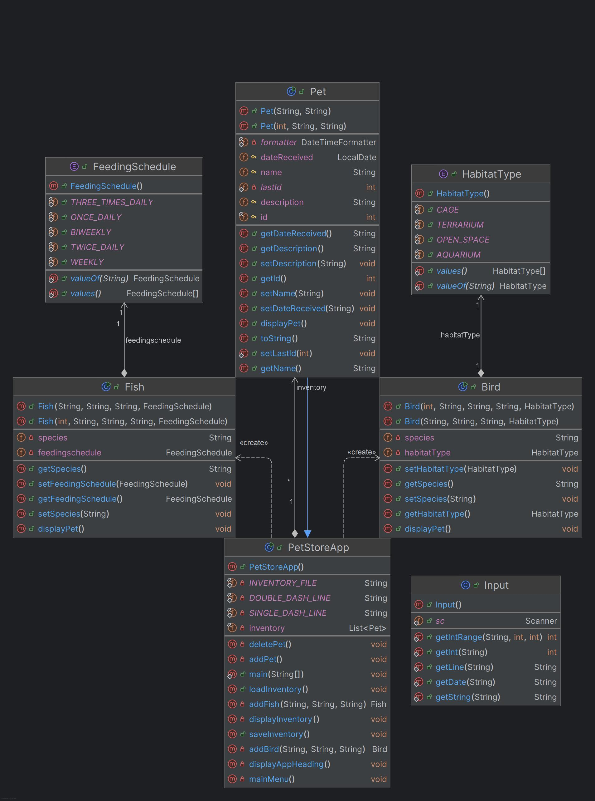

# Pet Store Application

## Overview
The Pet Store Application is a Java-based application that allows users to manage an inventory of pets, including birds and fish. The application provides functionalities to add, delete, and display pets, as well as save and load the inventory from a file.

## Features
- Add new birds and fish to the inventory
- Delete pets from the inventory
- Display the current inventory of pets
- Save the inventory to a file
- Load the inventory from a file

## Classes and Enums
### Classes
- **PetStoreApp**: Main application class that handles user interactions and manages the inventory.
- **Input**: Utility class for handling user input.
- **Pet**: Base class for all pets, containing common attributes and methods.
- **Bird**: Subclass of `Pet` representing birds, with additional attributes for species and habitat type.
- **Fish**: Subclass of `Pet` representing fish, with additional attributes for species and feeding schedule.

### Enums
- **HabitatType**: Enum representing different types of habitats for birds.
- **FeedingSchedule**: Enum representing different feeding schedules for fish.

## Getting Started
### Prerequisites
- Java Development Kit (JDK) 8 or higher
- IntelliJ IDEA or any other Java IDE

### Installation
1. Clone the repository:
    ```sh
    git clone https://github.com/isguil02/PetStore
    ```
2. Open the project in your IDE.
3. Build the project to resolve dependencies.

### Running the Application
1. Navigate to the `PetStoreApp` class.
2. Run the `main` method to start the application.

## Usage
Follow the on-screen prompts to add, delete, and display pets in the inventory. Use the save and load options to persist the inventory data.

## UML Diagram


## Example
Here is an example of the code running:

